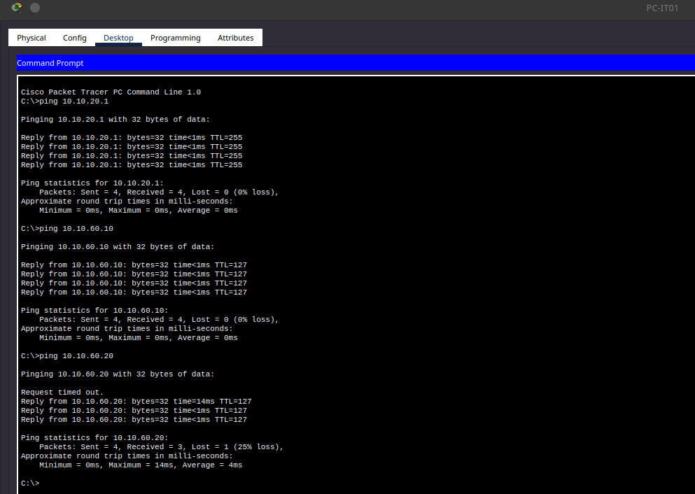

# Enterprise Network Lab

## Overview

This project simulates a small enterprise network built entirely in Cisco Packet Tracer. The objective was to design, configure, validate, and document a segmented network using industry-standard networking concepts including VLANs, Router-on-a-Stick inter-VLAN routing, centralized DHCP, and enterprise network documentation.

Rather than focusing solely on connectivity, this project emphasizes proper network planning, documentation, implementation, and validation to mirror the workflow used during real infrastructure deployments.

---

## Project Objectives

- Design a scalable enterprise network topology
- Implement departmental network segmentation using VLANs
- Configure Layer 2 switching and IEEE 802.1Q trunking
- Implement Router-on-a-Stick inter-VLAN routing
- Deploy centralized DHCP services
- Validate connectivity across multiple network segments
- Produce professional implementation documentation

---

## Network Overview

### Physical Topology


### Devices

- Cisco ISR 2911 Router
- Cisco Catalyst 2960 Core Switch
- Two Cisco Catalyst 2960 Access Switches
- DHCP Server (DC01)
- Network Printer
- Ten Department Workstations

### Departments

- Management
- Information Technology
- Human Resources
- Finance
- Sales
- Servers
- Guest

---

## Implemented Features

VLAN Segmentation
Router-on-a-Stick
Centralized DHCP
SSH Remote Management
Switch Management VLAN
Port Security
Unused Port Hardening
MOTD Banner
Static Infrastructure Addressing
Enterprise Network Documentation

---

## Repository Structure

```text
Enterprise-Network-Lab/
│
├── README.md
│
├── docs/
│   ├── ip-addressing.md
│   ├── vlan-design.md
│   ├── device-inventory.md
│   ├── dhcp-configuration.md
│   ├── security-hardening.md
│   ├── configuration-notes.md
│   └── troubleshooting.md
│
├── screenshots/
│   ├── topology/
│   ├── device-management/
│   ├── switching/
│   ├── routing/
│   ├── dhcp/
│
└── Enterprise-Network-Lab.pkt
```

---

# Documentation

Detailed implementation documentation is organized within the `docs` directory.

| Document | Description |
|-----------|-------------|
| **** | IP addressing plan, subnet allocation, gateways, and DHCP scopes |
| **** | VLAN assignments, switch port mappings, and trunk design |
| **** | Inventory of all network devices and infrastructure |
| **** | Summary of configuration tasks completed throughout implementation |
| **** | DHCP server configuration, relay implementation, address pool design, and client address assignment |
| **** | SSH management, switch management VLAN, MOTD banner, port security, and unused port hardening |
| **** | Common issues encountered during deployment and their resolutions |

---

## Skills Demonstrated

### Networking

- Enterprise Network Design
- VLAN Design and Segmentation
- Layer 2 Switching
- IEEE 802.1Q Trunking
- Router-on-a-Stick
- Inter-VLAN Routing
- DHCP Deployment
- DHCP Relay (ip helper-address)
- Static Infrastructure Addressing
- IP Address Planning
- Enterprise Network Documentation

### Cisco IOS

- Basic Device Configuration
- Interface Configuration
- VLAN Management
- Access Port Configuration
- Trunk Configuration
- Router Subinterface Configuration
- Switch Management Interfaces
- SSH Remote Management
- RSA Key Generation
- Local User Authentication
- Login Banner (MOTD)
- Port Security
- Unused Port Hardening
- Configuration Management
- Network Validation

---

## Validation

### Inter-VLAN Routing Validation

***Successful ping test from PC-IT01 to the default gateway, domain controller (DC01), and shared network printer.***



The completed enterprise network was successfully validated by verifying:

- VLAN segmentation
- Access port assignments
- IEEE 802.1Q trunk connectivity
- Router-on-a-Stick operation
- Inter-VLAN routing
- DHCP relay functionality
- DHCP address assignment
- Client-to-server communication
- Client-to-printer communication
- Cross-department connectivity
- SSH remote management
- Switch management interfaces
- Port Security operation
- Administrative shutdown of unused switch ports

---

## Future Improvements

The following enterprise networking features are planned for future implementation:

- Access Control Lists (ACLs)
- DHCP Snooping
- Dynamic ARP Inspection (DAI)
- BPDU Guard
- PortFast
- Storm Control
- Syslog Server Integration
- SNMP Monitoring
- Network Time Protocol (NTP)

---

## Project Status

**Current Status:** In Progress

✔ Enterprise network architecture completed

✔ Layer 2 switching completed

✔ Router-on-a-Stick implemented

✔ Centralized DHCP implemented

✔ Network validation completed

✔ Security hardening implemented (CAN BE IMPROVED)

✔ SSH management implemented

✔ Port security implemented

⬜ ACL implementation
