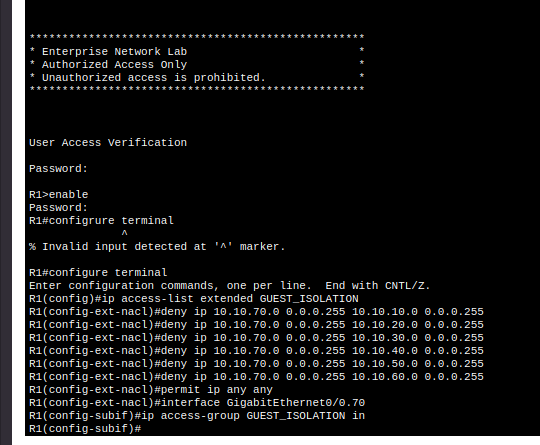
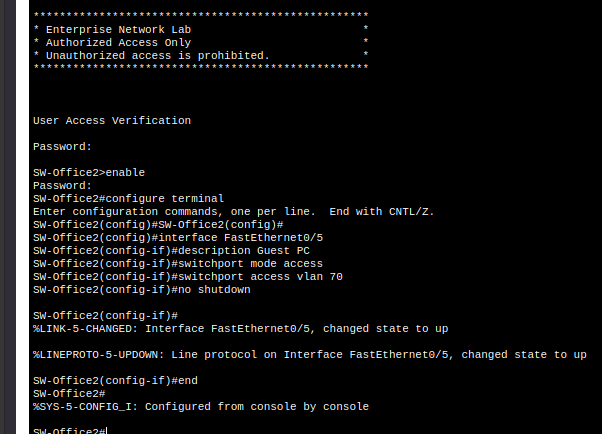
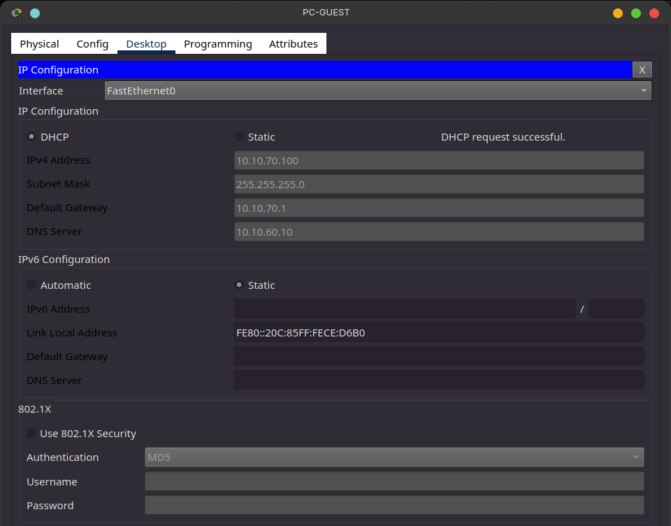
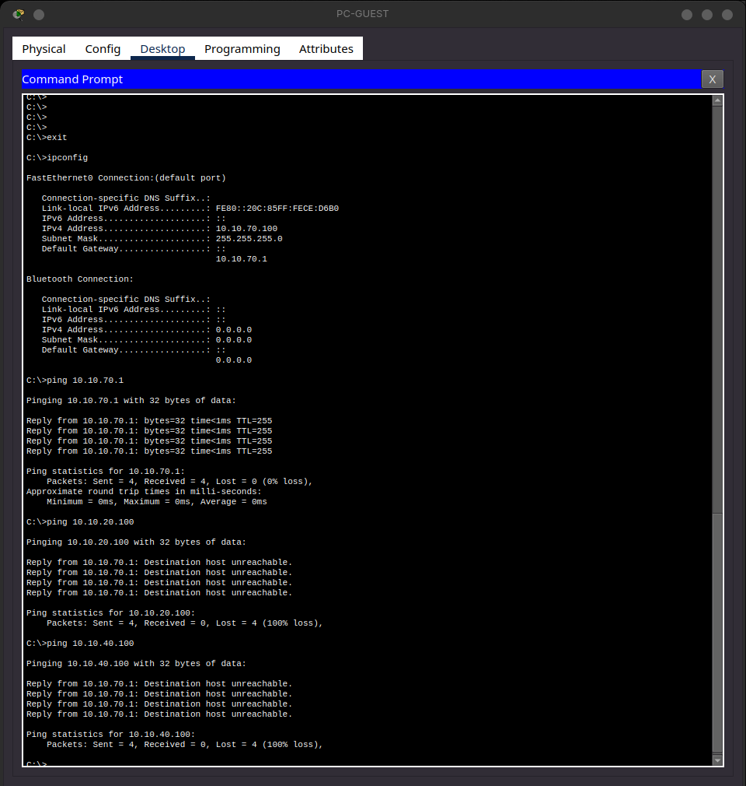
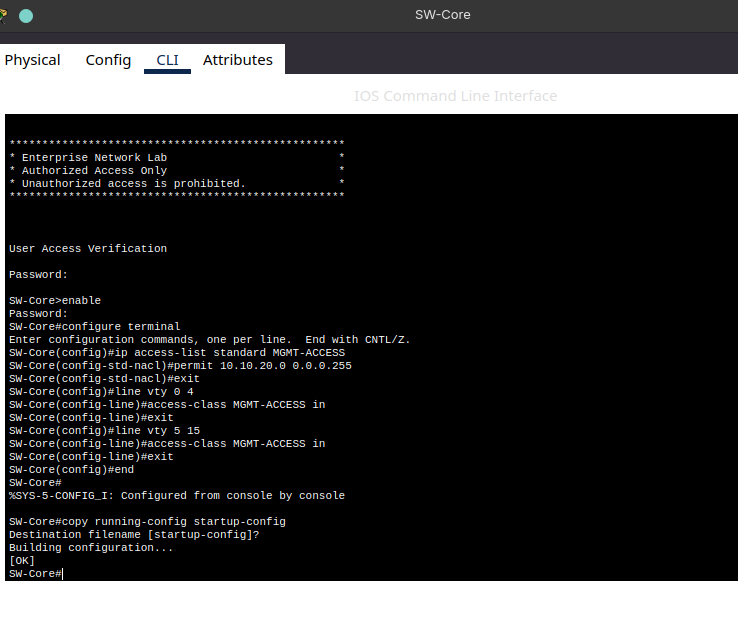
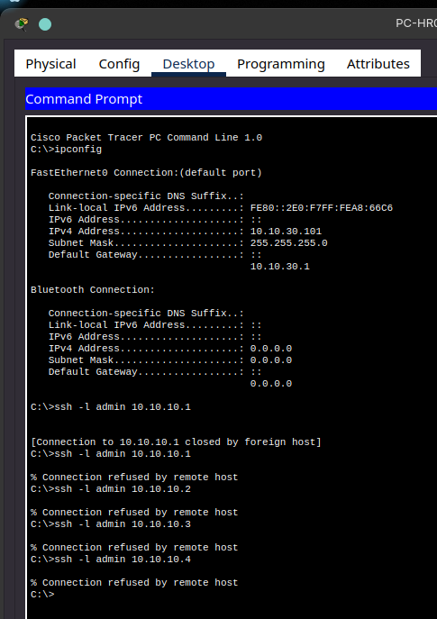
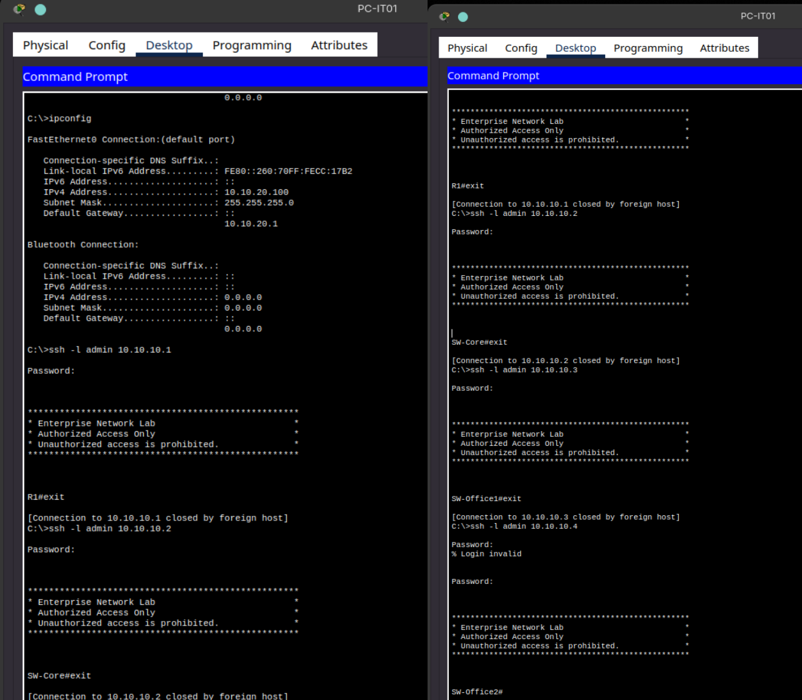
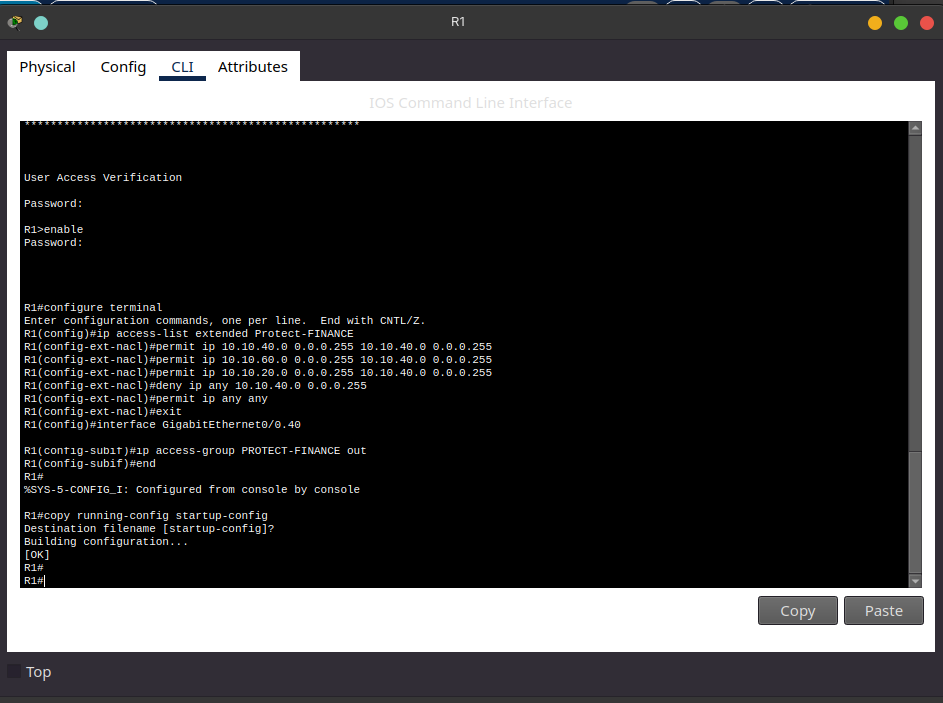
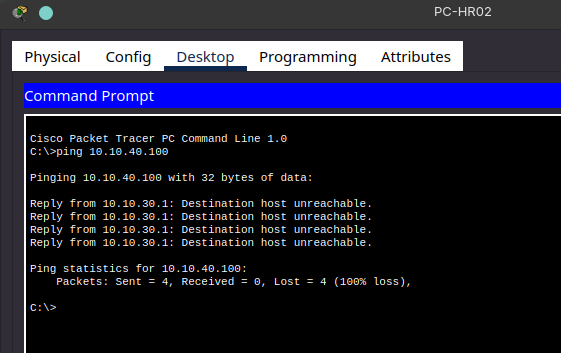
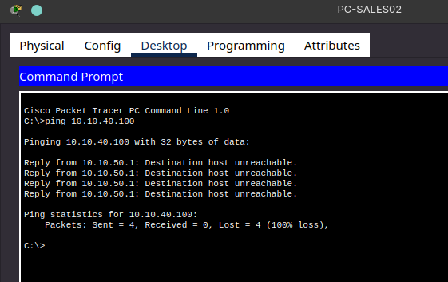

# ACL Configuration
Access Control List Configuration

## Overview

To further segment and secure this simulated enterprise network, 
three access control lists were implemented on the router.
These ACLs enforce least-privilege access between departments, restrict management plane access, 
and protect sensitive department resources from unauthorized inter-VLAN traffic.

---

## ACL 1 - Guest VLAN isolation

**Purpose:** Prevent the Guest VLAN from reaching any internal department subnet while still allowing
general outbound connectivity. (Internet Access)

**Applied on:** Guest subinterface, inbound direction

*I ran this on the router R1 to configure the ACL*

**Validation:**
I created a Guest PC and connected it to the office switch #2

From the SWOffice2 I configured the connection to the Guest PC

I then switched the IP Config on the Guest PC to DHCP and verified it got an appropriate IP address.

I then tried pinging tested the ACL from the Guest PC by first pinging the Guest VLAN Gateway which succeeded as expected.

Then I tried pinging an IT PC and a Finance PC which both returned with host unreachable. That is the exact behavior I was looking to achieve

---

## ACL 2 - Management Plan Access Restriction

**Purpose:** Restrict SSH access to network infrastructure (router and switches) so that only IT VLAN can remotely manage them.

**Applied on:** VTY lines (router), inbound direction.

*I ran this configuration on all network devices (Router R1, Switches - SWCore SWOffice1 and SWOffice2*

After setting the configuration for each network device I tested ssh to them from both an IT PC which should succeed, and an HR PC which should be denied.

*SSH Fails to Router and Switches from HR PC as expected*

*SSH From IT PC succeeds for each network device so this ACL is behaving as intended*

---

## ACL 3 - Finance VLAN Protection

**Purpose:** Restrict access to the Finance VLAN so that only Finance itself, the server VLAN (hosting Finance application/database resources), and IT (for support purposes) can reach it. All other departments are denied.

**Applied on:** Finance subinterface, inbound direction

I first ran this on R1 the router to configure the ACL rules to protect the Finance VLAN

I ran into a few issues at first by confiuring it wrong and allow for both inbound and outbound which didn't restrict access from other department VLANs. I also had a mismatch of capitalization in the ACL name. 

I cleaned up the config on R1 and then retested ping from an IT and Finance PC to another Finance PC which succeeded as expected.

I then tested ping from an HR PC to a Finance PC which failed as wanted.

And I tested ping from a Sales PC to a Finance PC which also failed as wanted.

---

## Final Result

All three ACLs were successfully configured and validated. Guest VLAN traffic is isolated from internal department networks, SSH management access is restricted to the IT VLAN, and the Finance VLAN is protected from unauthorized inter-VLAN access while remaining accessible to authorized IT, server, and Finance systems.

The ACL configuration now enforces the intended least-privilege access controls and completes the network security configuration for this lab.
