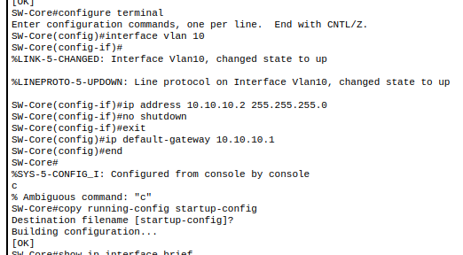
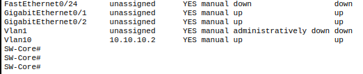
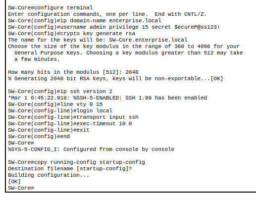
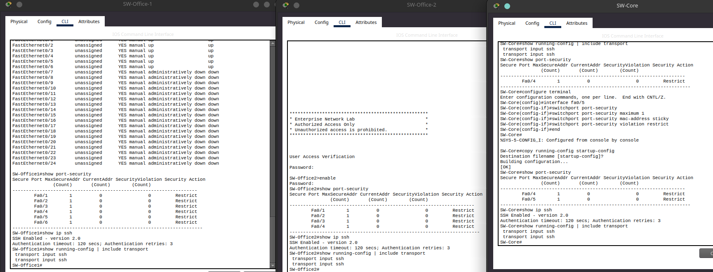
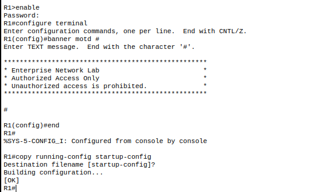
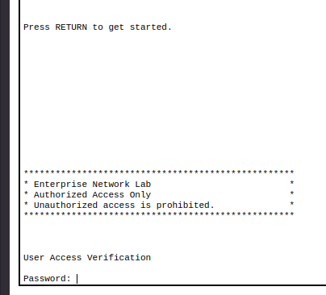
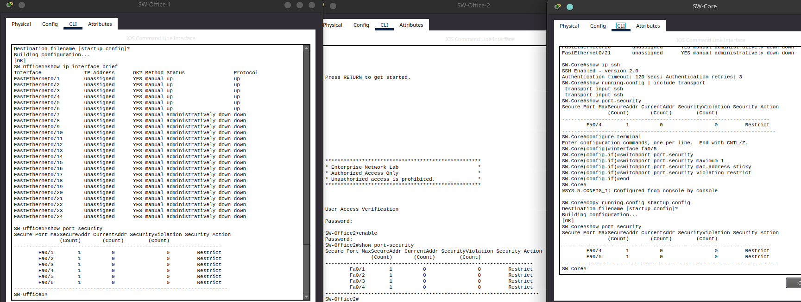

# Security Hardening

## Overview

After validating network connectivity, several baseline security controls were implemented
to improve the security an manageability of the network.

These configurations focus on protecting management access, limiting unauthorized network access,
and preparing the infrastructure for future security enhancements.

Implemented security features include:

- Secure device management using SSH
- Dedicated management VLAN interfaces
- Login warning banner (MOTD)
- Shutdown of unused switch interfaces

---

# Switch Management Interfaces 

Each Cisco switch was assigned a management IP address on the Management VLAN (VLAN 10)

This allows administrators to remotely manage switches without relying on the default VLAN
while providing a dedicated management network.

Each switch was configured with:

- VLAN 10 management interface
- Static management IP address
- Default gateway pointing to the router management interface

### Configuration

*Setting up Static IP for Core Switch (Repeated for both office switches but with their respective addresses)*

### Verification

--- 

# SSH Remote Management

Telnet was disabled and Secure Shell (SSH) Version 2 was configured to encypt 
administrative connections.

Each network device was configured with:

- Local admin account
- Enterpise domain name
- 2048 bit RSA encryption keys
- SSH Version 2
- VTY lines restricted to SHH only.

This provides encrypted remote management while preventing insecure Telnet access.

### Configuration

*SSH Config for the Core Switch (Repeated for Router (R1) AND both office switches)*

### Verification

---

# Login Banner (MOTD)

A Message of hte Day (MOTD) banner was configured on all the network devices to display 
an authurization warning at login.

Although simple, login banners are considered a standard enterprise security practice
and provide legal notice against unauthorized access.

### Configuration

*MOTD Banner config for Router R1 (Repeated for all network devices)*

### Verification

---

# Port Security

Port Security was enabled on all switch access ports connected to end-user devices

Each protected interface was configured to:

- Allow a maximum of one MAC address
- Learn the connected device automatically using Stick MAC
- Restric unauthorized devices without shutting down the interface

This reduces the risk of unauthorized devices being connected o the network
while allowing normal workstation replacements.

### Configuration

*Port Security config for Office 1 switch (Repeated for all the switches dependant on what ports are used)*

### Verification

---

# Unused Port Hardening

Unused switch interfaces were administratively disabled to reduce the attack surface 
and prevent unautorized devices from being connected.

Interfaces reserved for future expansion remain diabled until required.

### Configuration
*Any unused ports shutdown (used ports verfied using 'show vlan brief' | repeated for all network devices) 

### Verification

---

# Security Summary

The following security controls have been successfully implemented throughout the network.

| Control | Status |
|---------|--------|
| Secure device passwords | ✔ |
| SSH Version 2 | ✔ |
| RSA Encrypton Keys | ✔ |
| Local Administrator Account | ✔ |
| Management VLAN Interfaces | ✔ |
| Login Banner (MOTD) | ✔ |
| Port Security | ✔ |
| Unused Port Shutdown | ✔ |

---

# Future Improvements

The following security controls are planned for future implementation:

- Access Control Lists (ACLs)
- Dynamic ARP Inspection (DAI)
- DHCP Snooping
- BPDU Guard
- Storm Control
- Syslog Server Integration
- SNMP Monitoring
